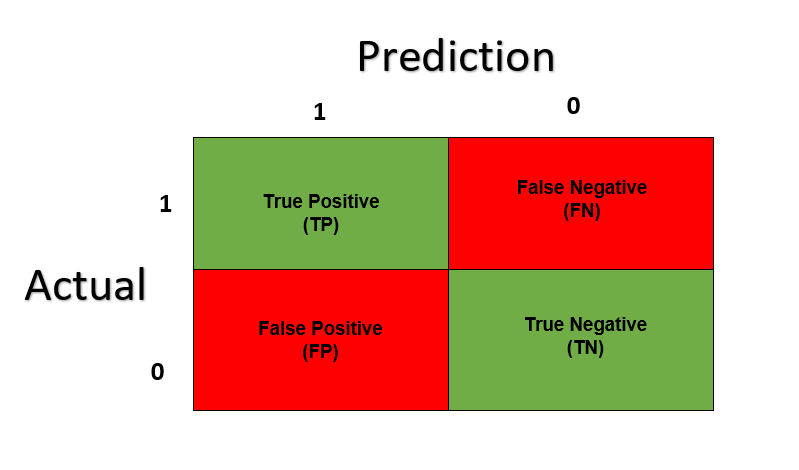

date: `r format(Sys.time(), "%d-%m-%Y")`

```{=html}
<style type="text/css">
.main-container {
  max-width: 1600px;
  margin-left: 100px;
  margin-right: auto;
}
</style>
```
```{r , message=FALSE, warning=FALSE, include = FALSE, eecho = FALSE}

#suppressWarnings(library(RODBC))

library(ggplot2)
library(ggpubr)
library(markdown)
library(shiny)
library(shinythemes)
library(tidyverse)
library(magrittr)
library(lubridate)
library(plotly)
library(xts)
library(dygraphs)
library(kableExtra)
library(knitr)
library("readxl")
library(rsconnect)
library(dplyr)
library(summarytools)
library(epiDisplay)
#library(leaflet)
library(haven)
library(epiDisplay)
library("readxl")
library(expss)
library(hrbrthemes)
library(viridis)
library(viridisLite)
library(DescTools)
library(roperators)
library(shinycssloaders)
library(writexl)
library(labelled)
library(tidyverse)
library(haven)
library(readr)
library(sjmisc)
library(WriteXLS)

library(ineq)
library(readstata13)
library(reldist)
set.seed(123)
library(DT)
library(caTools)
```

# Introducción

Por alguna extraña razón la Casen del 2020 no contiene la variable que identifica el alfabetismo de las personas, el cual históricamente desde el 2006 al 2017 se ha mantenido bajo el 4%. Lo necesitamos. Nuestra metodología será aplicar una regresión logística sobre alguno de los ingresos, el nivel educacional alcanzado y la ruralidad para construir un **clasificador**, cuyo objetivo será para el año 2020 construir en términos binarios la estructura de la respuesta al alfabetismo.

Como resultado final obtenemos que la tasa de analfabetismo para el 2020 está estimado en un 3,402% de anafabetismo, representando a unas 663.436 personas. La **cifra oficial** es de Un total de 516 mil 960 personas en Chile que no saben leer ni escribir[^1](publicación con motivo del Día Internacional de la Alfabetización establecido por la ONU desde 1967).

La Encuesta de Caracterización Socioeconómica Nacional (CASEN) de 2017, que se realiza con una periodicidad trienal, indica que en Chile el 3,7 por ciento de las mujeres mayores de 15 años son analfabetas, mientras que entre los hombres en ese rango de edad el porcentaje es de 3,5 (3.6 en promedio)

Las variables utilizadas serán ("e6a","zona","yaut", "ysub", "ytot", "ytrabajocor","yoprcor","ymonecorh","EDUC" y "e1") que extraemos de la Casen del 2017.

# [Regresión logística]{style="color:blue"}

Leeremos las bases de datos de las Casen 2015, 2017 y 2020

# 2017

Primero construiremos un modelo para el 2017 extrayendo las variables que necesitamos y reconstruímos las categorías de respuesta a la pregunta e1 para obtener un resultado dicotómico.

```{r, warning=FALSE}
# casen_2006 <- readRDS(file = "C:/Users/enamo/Desktop/Shiny-R/Casen_en_pandemia_2020/casen/casen_2006_c.rds")
# casen_2009 <- readRDS(file = "C:/Users/enamo/Desktop/Shiny-R/Casen_en_pandemia_2020/casen/casen_2009_c.rds")
# casen_2011 <- readRDS(file = "C:/Users/enamo/Desktop/Shiny-R/Casen_en_pandemia_2020/casen/casen_2011_c.rds")
casen_2015 <- readRDS(file = "C:/Users/chris/OneDrive/Documentos/archivos_grandes/casen_2015_c.rds")
casen_2017 <- readRDS(file = "C:/Users/chris/OneDrive/Documentos/archivos_grandes/casen_2017_c.rds")
casen_2020 <- readRDS(file = "C:/Users/chris/OneDrive/Documentos/archivos_grandes/casen2020.rds")

data_2017 <- casen_2017[,c("e6a","zona","yaut", "ysub", "ytot", "ytrabajocor","yoprcor","educ","e1")]
data_2017 [is.na(data_2017 )] <- 0

head(data_2017,5)
```


```{r}
data_2017$e1 <- as.character(data_2017$e1)
data_2017$e1[data_2017$e1 == 'Sí, lee y escribe'] <- 1
data_2017$e1[data_2017$e1 == 'No, sólo lee'] <- 0
data_2017$e1[data_2017$e1 == 'No sabe/responde'] <- 0
data_2017$e1[data_2017$e1 == 'No, ninguno'] <-0
data_2017$e1[data_2017$e1 == 'No, sólo escribe'] <- 0
data_2017$e1[is.na(data_2017$e1)] <- 0
data_2017 <- mutate_if(data_2017, is.factor, as.numeric)
dataset <- data_2017
dataset$e1 <- as.numeric(dataset$e1)
head(dataset,5)

```
El total de encuestados en la Casen del 2017 fueron 216439 individuos.


```{r}
nrow(data_2017)
```

### EL MODELO

### Implementacion para el 2017

```{r, warning=FALSE}

data_2017 <- casen_2017[,c("e6a","zona","yaut", "ysub", "ytot", "ytrabajocor","yoprcor","e1")]

data_2017 [is.na(data_2017 )] <- 0

data_2017$e1 <- as.character(data_2017$e1)
data_2017$e1[data_2017$e1 == 'Sí, lee y escribe'] <- 1
data_2017$e1[data_2017$e1 == 'No, sólo lee'] <- 0
data_2017$e1[data_2017$e1 == 'No sabe/responde'] <- 0
data_2017$e1[data_2017$e1 == 'No, ninguno'] <-0
data_2017$e1[data_2017$e1 == 'No, sólo escribe'] <- 0
data_2017$e1[is.na(data_2017$e1)] <- 0
data_2017 <- mutate_if(data_2017, is.factor, as.numeric)

data_2017$e1 <- as.numeric (data_2017$e1)
head (data_2017,5)
```


```{r, warning=FALSE}
# division aleatoria de sets
split = sample.split(data_2017$e1, SplitRatio = 0.8)
training_set = subset(data_2017, split == TRUE)
testing_set = subset(data_2017, split == FALSE)

# estandarizacion
training_set[,1:7] = scale(training_set[,1:7])
testing_set[,1:7] = scale(testing_set[,1:7])
```

```{r, warning=FALSE}
# generacion del clasificador:

classifier = glm(formula = e1 ~ .,
                 data = training_set, 
                 family = binomial)

# Prediccion de los data_2017con el conjunto de testing
prob_pred = predict(classifier, type = "response",
                    newdata = testing_set[,-8])

e1_pred = ifelse(prob_pred > 0.01, 1, 0)
```

```{r, warning=FALSE}
# matriz de confusion
tb = table(testing_set[, 8], e1_pred)
tb <- as.data.frame(tb)
tb <- as.data.table(tb)
tb
```

```{r}
1680		*100/(1680+22		+8127	+33459)
```

1 vn\
2 fn\
3 fp\
4 vp

## Tests de evaluación en predicciones (tablas de contingencia)


{width='1000px'}


### Exactitud (Acurracy)

En general, que porcentage de la data clasifica correctamente?


```{r}
(tb[4,3]+tb[1,3])/sum(tb$Freq)
```

### Tasa de error (Misclassification Rate)

En general, que porcentage de la data clasifica incorrectamente?

```{r}
(tb[3,3]+tb[2,3])/sum(tb$Freq)
```

### Sensibilidad, exhaustividad, Tasa de verdaderos positivos

Cuando la clase es positiva, que porcentaje logra clasificar?

tp/(tp+fn)

```{r}
(tb[4,3])/sum(tb[4,3]+tb[2,3])
```

### Especificidad, tasa de verdaderos negativos

Cuando la clase es negativa, que porcentaje logra clasificar?

tn/tn+fp

```{r}
(tb[1,3])/sum(tb[1,3]+tb[3,3])
```

### Precisión

Cuando predice positivos, que porcentaje clasifica correctamente?

vp/Total clasificados positivos

```{r}
(tb[4,3])/sum(tb[3,3]+tb[4,3])
```

### Valor de predicción negativo

Cuando predice negativo, que porcentage clasifica correctamente?

vn/Total clasificados negativo

```{r}
(tb[1,3])/sum(tb[2,3]+tb[1,3])
```

### Implementacion para el 2015

```{r, warning=FALSE}
data_2015w <- casen_2015[,c("e6a","zona","yaut", "ysub", "ytot", "ytrabajoCor","yoprCor","educ","e1")]

names(data_2015w)[6] <- "ytrabajocor"
names(data_2015w)[7] <- "yoprcor"

data_2015w[is.na(data_2015w)] <- 0


data_2015w$e1 <- as.character(data_2015w$e1)
data_2015w$e1[data_2015w$e1 == 'Sí, lee y escribe'] <- 1
data_2015w$e1[data_2015w$e1 == 'No, sólo lee'] <- 0
data_2015w$e1[data_2015w$e1 == 'No sabe/responde'] <- 0
data_2015w$e1[data_2015w$e1 == 'No, ninguno'] <-0
data_2015w$e1[data_2015w$e1 == 'No, sólo escribe'] <- 0
data_2015w$e1[is.na(data_2015w$e1)] <- 0

data_2015w <- mutate_if(data_2015w, is.factor, as.numeric)

data_2015w[,1:8] = scale(data_2015w[,1:8])

# Prediccion de los data_2017ados con el conjunto de testing
prob_pred = predict(classifier, type = "response", data_2015w)

y_pred = ifelse(prob_pred >  0.01, 1, 0)
 
data_2015w$e1_pred <- y_pred

datatable(head(data_2015w,10), escape = FALSE, rownames = FALSE, options = list( scrollX = TRUE))

```

```{r}
nrow(casen_2015)
```

```{r}
tb2 = table(data_2015w$e1, data_2015w$e1_pred)
tb2 <- as.data.frame(tb2)
tb2 <- as.data.table(tb2)
tb2
```

```{r}
11075		*100/(11075	+173+51749	+203971	)
```

### Exactitud (Acurracy)

En general, que porcentage de la data clasifica correctamente?

```{r}
(tb2[4,3]+tb2[1,3])/sum(tb2$Freq)
```

### Tasa de error (Misclassification Rate)

En general, que porcentaje de la data clasifica incorrectamente?

```{r}
(tb2[3,3]+tb2[2,3])/sum(tb2$Freq)
```

### Sensibilidad, exhaustividad, Tasa de verdaderos positivos

Cuando la clase es positiva, que porcentaje logra clasificar?

tp/(tp+fn)

```{r}
(tb2[4,3])/sum(tb2[4,3]+tb2[2,3])
```

### Especificidad, tasa de verdaderos negativos

Cuando la clase es negativa, que porcentaje logra clasificar?

tn/tn+fp

```{r}
(tb2[1,3])/sum(tb2[1,3]+tb2[3,3])
```

### Precisión

Cuando predice positivos, que porcentaje clasifica correctamente?

vp/Total clasificados positivos

```{r}
(tb2[4,3])/sum(tb2[3,3]+tb2[4,3])
```

### Valor de predicción negativo

Cuando predice negativo, que porcentage clasifica correctamente?

vn/Total clasificados negativo

```{r}
(tb2[1,3])/sum(tb2[2,3]+tb2[1,3])
```

## Implementacion para el año 2020:

```{r, warning=FALSE}
data_2017_2020 <- casen_2020[,c("e6a","zona","yaut", "ysub", "ytot", "ytrabajocor","yoprcor","educ")]

# para correr la regresion binomial no deben existir NA, los cuales son reemplazados por ceros.:
data_2017_2020[is.na(data_2017_2020)] <- 0

data_2017_2020 <- mutate_if(data_2017_2020, is.factor, as.numeric)

data_2017_2020[,1:8] = scale(data_2017_2020[,1:8])

prob_pred = predict(classifier, type = "response",data_2017_2020)

y_pred = ifelse(prob_pred >  0.01, 1, 0)
  
data_2017_2020$e1_pred <- y_pred

datatable(head(data_2017_2020,10), escape = FALSE, rownames = FALSE, options = list( scrollX = TRUE))

datatable(head(data_2017_2020,10), escape = FALSE, rownames = FALSE,
          options = list( scrollX = TRUE))

```

Ahora agregamos la variable predicha a la Casen 2020:


```{r, warning=TRUE}
casen_2020$e1 <- data_2017_2020$e1_pred
datatable(head(casen_2020,5), escape = FALSE, rownames = FALSE,
          options = list( scrollX = TRUE))

#saveRDS(casen_2020,"casen_2020_con_e1.rds")


casen_2020_1 <- casen_2020[1:1000,1:10]


kbl(casen_2020_1) %>%
  kable_styling(bootstrap_options = c("striped", "hover")) %>%
  kable_paper() %>%
  scroll_box(width = "100%", height = "300px")
```

```{r}

eliminated <- casen_2020
# a <- eliminated[,c(ingreso)]
# b <- eliminated$comuna
# c <- eliminated$sexo
d <- eliminated$e1 #alfabetismo
# e <- eliminated$r3 #etnia 
anio <- 2020

################ -- frecuencia
expan<-"expc"

tabla_matp <-xtabs(eliminated[,(expan)]~d , data = eliminated)
tabla_matp <- as.data.frame(tabla_matp)
tabla_matp <-tabla_matp[!(tabla_matp$Freq == 0),]
tabla_matp
################ 
```


```{r}
663436 * 100 / (663436	+ 18837026	)
```


[^1]:

<a href="https://rpubs.com/chzelada/275494">Evaluación de modelos de clasificación Carlos Zelada</a>

<a href="https://www.cronicadigital.cl/2020/09/08/mas-de-medio-millon-de-chilenos-son-analfabetos/">Analfabetismo en Chile</a>

<a href="https://en.wikipedia.org/wiki/Confusion_matrix">Confusion matrix</a>
